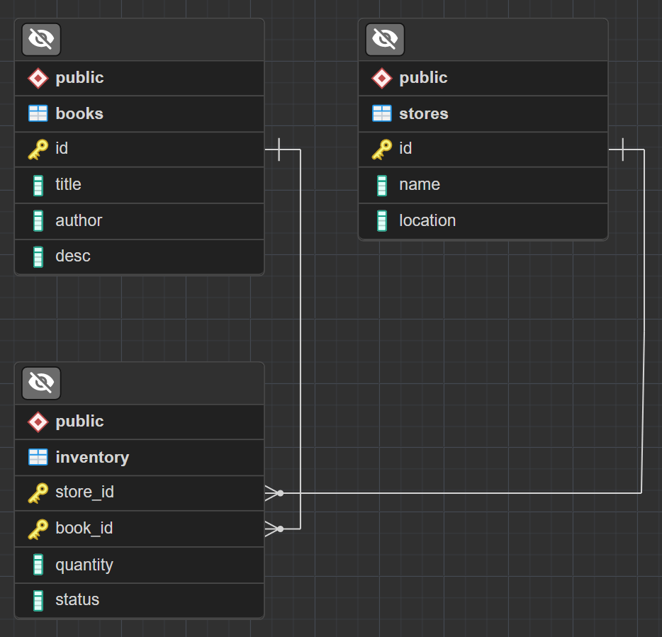

# Bookstores Inventory System

Inventory system for multiple bookstores containing the same copies of the same book, and notify when one or a set of books are out of stock in a specific bookstore. 
[You can skip to the Setup instructions](#setup).

------
### Requirements:

- API endpoints to get, create, update stock levels, delete book(s) from the bookstore database (CRUD operations)
- A book can have both status "in_stock" and "out_of_stock". Create a method that will be called every minute to detect whether any of the books will have a quantity of "0", if this is the case, it will update the status of the book to be out_of_stock.
- Ensure that when we update the quantity of a book, it will bring the status back to "in_stock" if the quantity is more than 0.

------
### Technologies Used:

- [Express.js](http://expressjs.com/en/4x/api.html) v4
- [Knex.js](https://knexjs.org/guide/) v2
- [postgreSQL](https://www.postgresql.org/docs/current/index.html) v15
- [pg](https://github.com/brianc/node-postgres) v8
- [Joi](https://joi.dev/api/?v=17.9.1) v17
- [Jest](https://jestjs.io/docs/getting-started) v29

------
### Database 

<p>Because there are multiple stores and multiple books with different quantities in each store this is a M:N (Many-to-Many) database relationship.</p>

<p> To simplify operations and abstract this complexity I added a junction table called inventory. You can see the databse ER diagram below:</p>


<p align="center">
 
</p>

<p> That way, it is possible to treat the stores and books tables individually without worring about them affecting each other.</p>

------

### Inventory Behavior

 It is important to keep the inventory table updated in relation to its parents, so there are important behaviors set to keep it consistent:

-   The inventory table's id is a pair of foreign keys ( **store_id** and **book_id** )

-   The inventory table is set to **cascade upon deletion** of a parent value. If you delete a book, all instances of inventory from that book will be deleted automatically by the table constraint. This is handled by the database ( no need for an API endpoint for inventory deletion )
-   When a new book is added, it is necessary to create and initialize all inventory instances in relation to stores. So when a book is added the server will run a transaction to create inventory data in every store with quantities initialized to zero  ( also no need for an API endpoint for inventory insertion )
-   similar to the previous point, the same is valid for when a new store is added. The server will run a transaction to create inventories of every book.
-   The inventory table holds a status that can be **in_stock** or **out_of_stock**. This property can be accessed by the client, but cannot be written. It's default value in the database is ' in_stock ' and the server will update its status when a quantity update is requested by the client, or when the server watch task detects that an item with quantity zero has status ' in_stock '.

------

### Features that could be added in future sprints

-   Add a users table
-   Add data encryption
-   Add user authentication:
    -   Registration 
    -   Login
    -   Logout
    -   read / write restrictions
-   Add timestamps for each table:
    -   created at timestamp
    -   updated at timestamp
-   Attach users to timestamps
    -   created by
    -   updated by


------

### Setup:

1. Clone this repository and install packages 
```cmd
git clone https://github.com/laradcm/bookstore-chain-system
cd .\bookstore-chain-system\
npm i
``` 

2. Create a local [postgreSQL](https://www.postgresql.org/docs/current/tutorial-start.html) database

3. Create a .env file in the root and add the variables according to the template: **.envTemplate**
    -  make sure the DB connection info is correct 
    ###

4. run the resetDB script ( it will run knex rollback, migrate and seed sequentially to setup your DB ):
```cmd
npm run resetDB
```
5. run the test script, it will test the db connection ( jest will run in watch mode ):
```cmd
npm run test
``` 
- To only watch the DB test, after you started the test script, you can press **p** and then write: **db.test**

6. If everything is good so far, it is time to start the server, just run **npm run dev** ( for nodemon ) or **npm run start** if you do not plan on doing any changes:
```cmd
npm run dev
``` 

7. After the server starts you should see your port being reported in the console:

```clg
listening on port:3000
``` 
8. you can now send requests from your favorite API tester! URL paths according to each table are:
```js
GET   /books          /inventory                      /stores        //reads all values
  
GET   /books/select   /inventory/select               /stores/select //reads values according to ids in body

GET   /books/:id      /inventory/:store_id/:book_id   /stores/:id    //reads a single value according to id

POST  /books                                          /stores        //creates a single value

PATCH /books          /inventory                      /stores        //updates values according to ids in body

PATCH /books/:id      /inventory/:store_id/:book_id   /stores/:id    //updates a single value according to id

DEL   /books                                          /stores        //deletes values according to ids in body

DEL   /books/:id                                      /stores/:id    //deletes a single value according to id
```
9. when a request is sent the server will post in on the console:
```clg
GET request received for /books from 127.0.0.1
``` 
10. The data input format for body requests is:
```json
[
    {
        "id":2
    },

    {
        "id":3
    }

]
```


ps.: There might be some environment variable issues if you execute jest or knex scripts from other folders than the ones described in the package.json file

